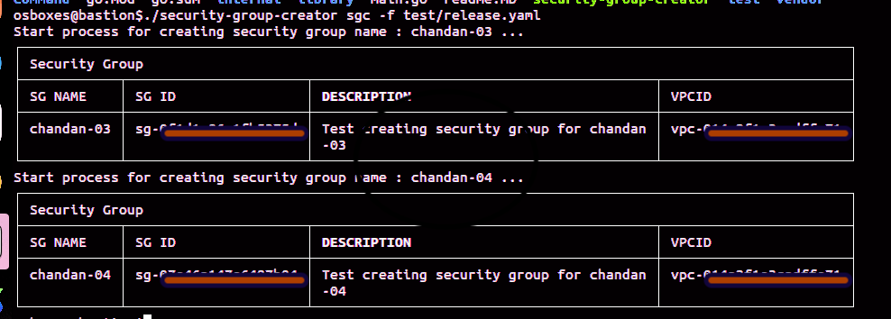

# Security Group Creator

## Overview
Security group creator is a command line tool for creating security group. It creates multiple security group through release yaml file. 

## Development setup
###### Git clone 
```base
git clone https://github.com/chandan4u/security-group-creator.git
```
###### Install project Go dependencies
```base
go mod vendor
``` 
###### Install project
The go install command behaves almost identically to go build , but instead of leaving the executable 
in the current directory, or a directory specified by the -o flag, it places the executable into 
the $GOPATH/bin directory.
```base
go install .
```
###### Run project locally
```base
security-group-creator --help
```

## Installation

###### Download and move security group go binary into bin folder
```base
sudo cp security-group-creator /usr/local/bin/
```
###### Test deployer command
```base
security-group-creator
```
It should return given below value
```base
Welcome | SecurityGroup is command line tool for creating security group on AWS
```

## Usage

###### Help command
To see the all option inside security group creator command line tool.
```base
security-group-creator --help
```

###### Version Command
To see the current version of security group creator command line tool.
```base
security-group-creator --version
```

###### Security group creator command
To create multiple security group.
```base
security-group-creator sgc -f <file path release.yaml>
./security-group-creator sgc -f test/release.yaml 
```
Using the Yaml file we can create multiple security groups.
```
security-groups:
  -
    name: chandan-03
    desc: testing security group
    vpc-id: idosa900q9w2
  -
    name: chandan-04
    desc: testing security group
    vpc-id: idosa900q9w2

```
Result format we get after successful creation


## Contributing
Pull requests are welcome. For major changes, please open an issue first to discuss what 
you would like to change.

Please make sure to update tests as appropriate.

## License
[Public Cloud]